# Results

[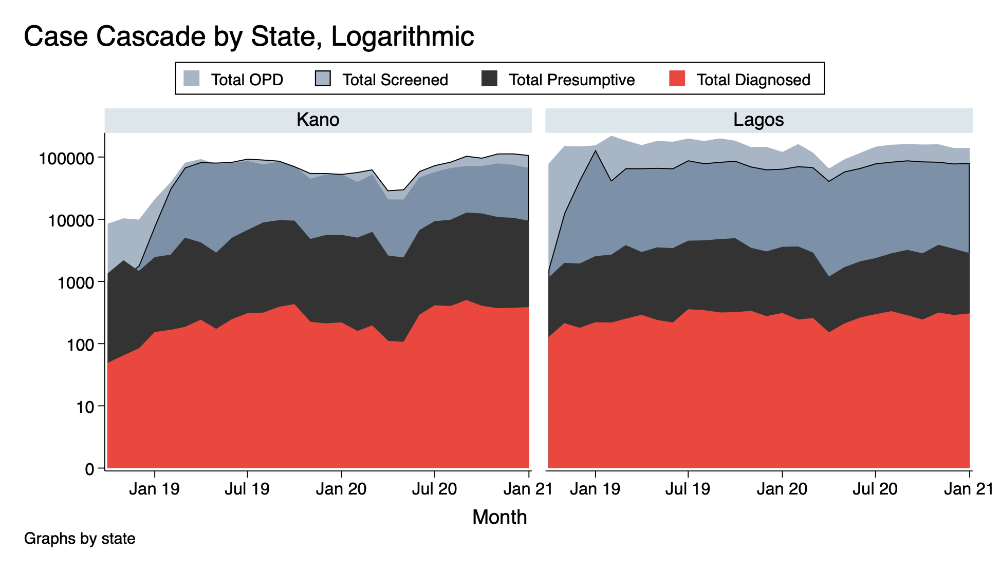](data/state.csv)

[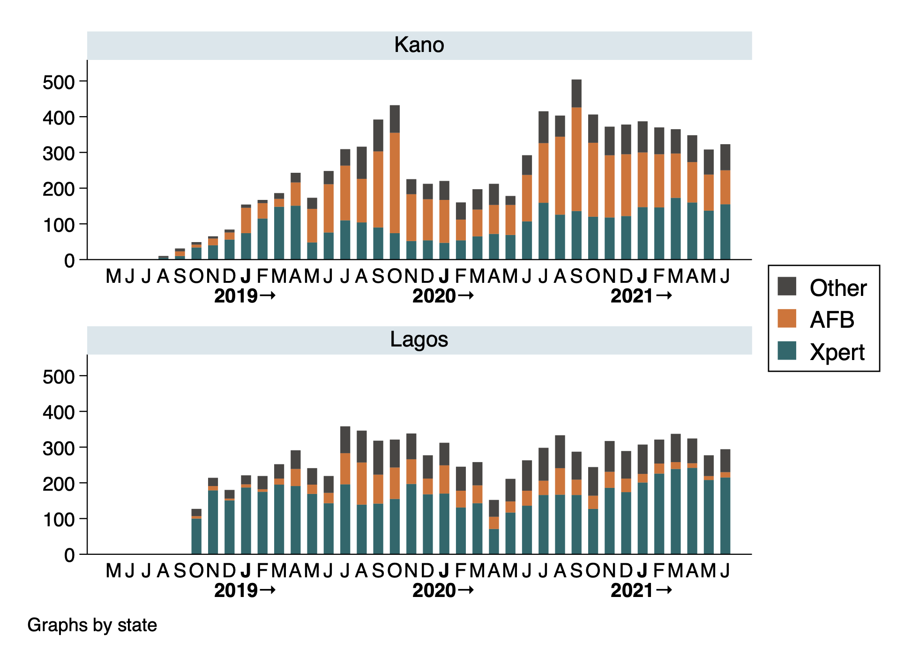](data/cases-state.csv)

[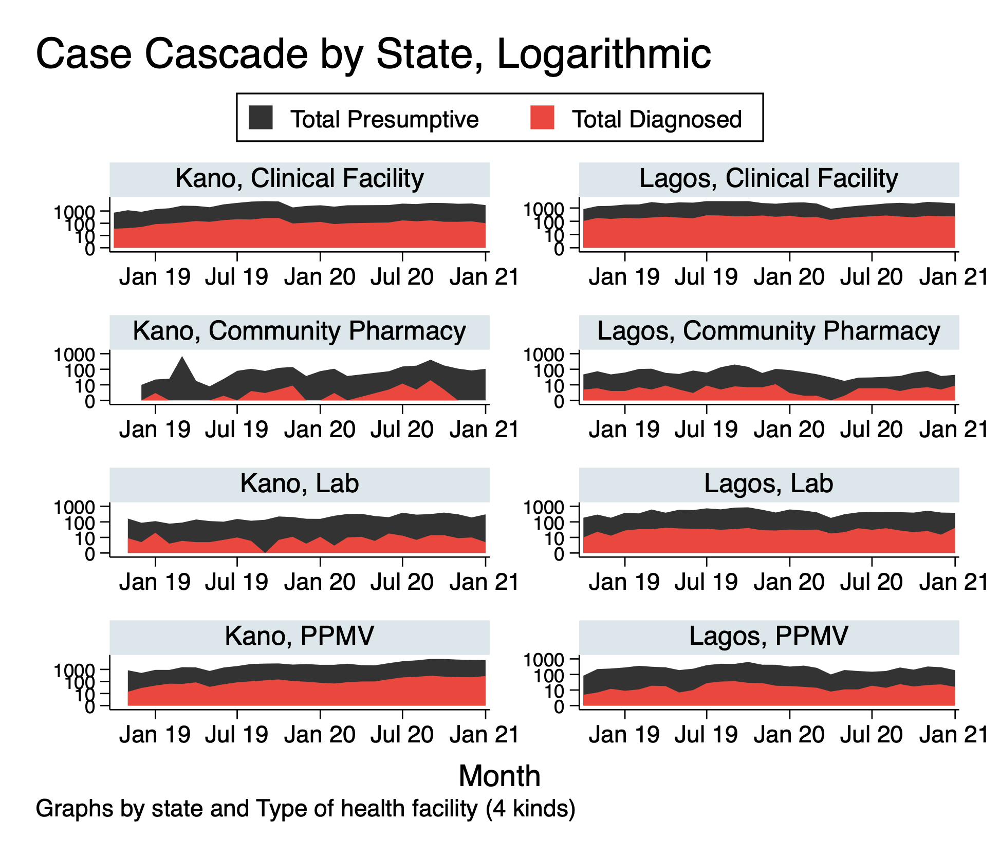](data/cascade-type.csv)

[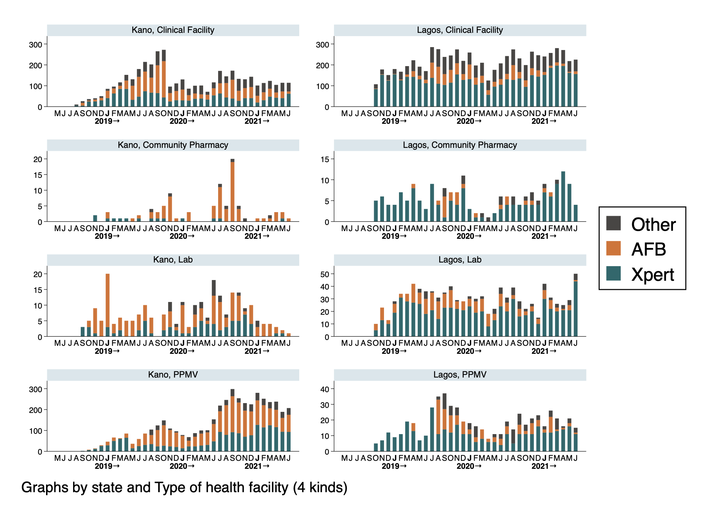](data/cases-fac_type.csv)

[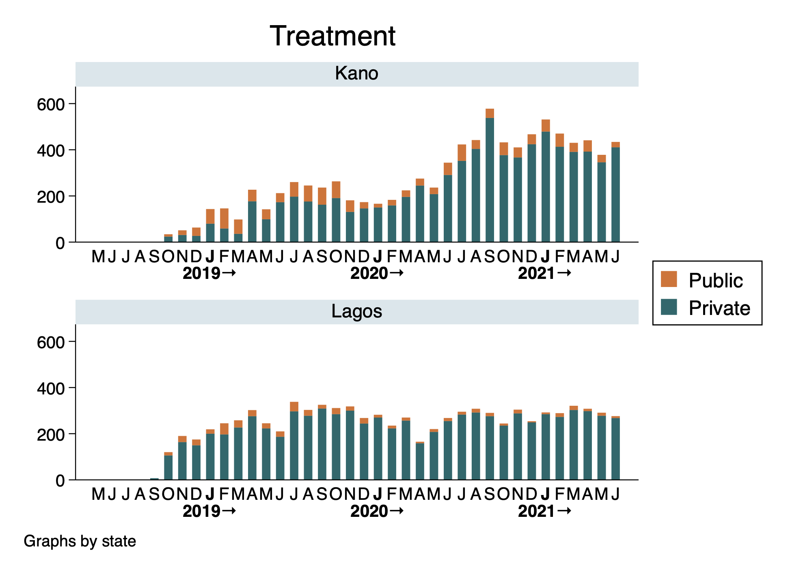](data/treat-state.csv)

[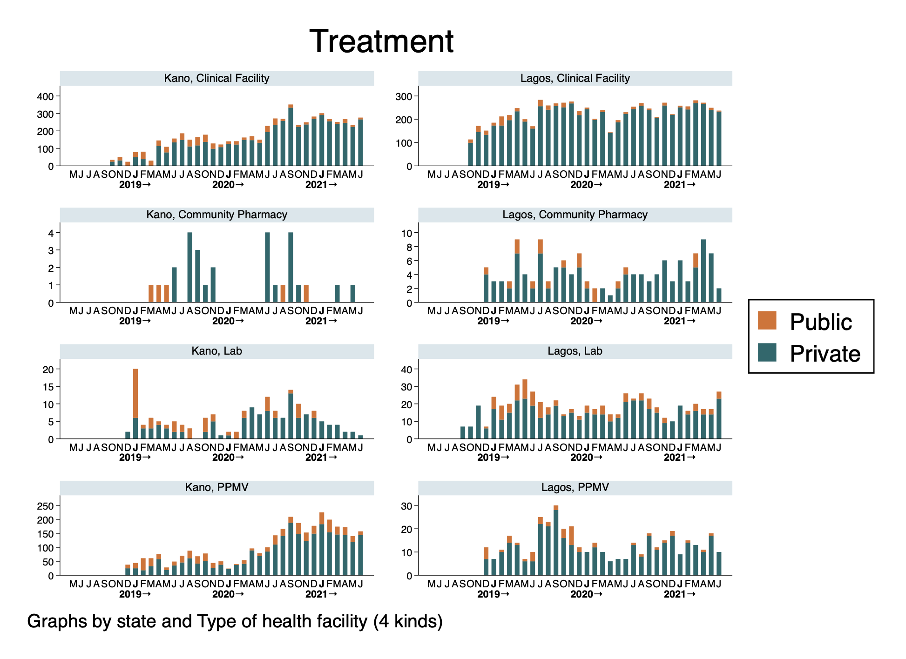](data/treat-fac_type.csv)

[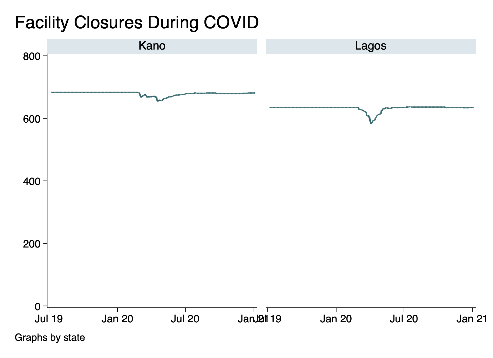](data/closures.csv)

[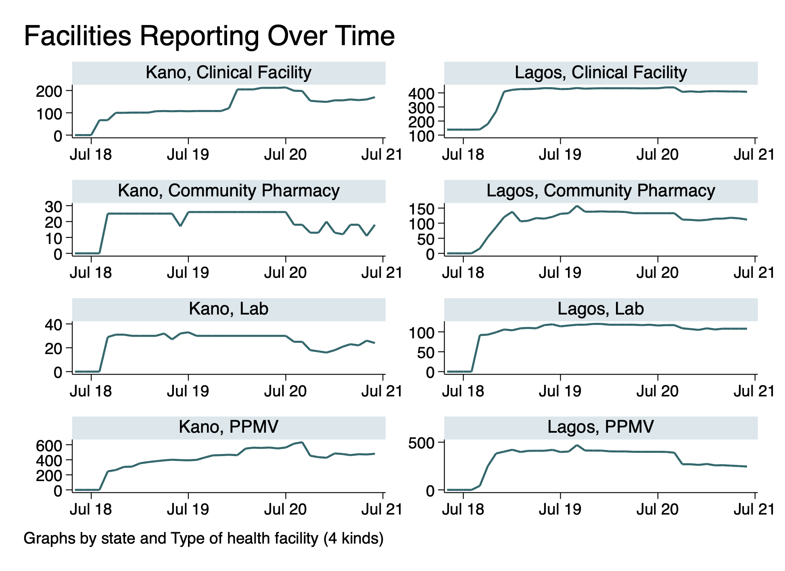](data/reporting.csv)

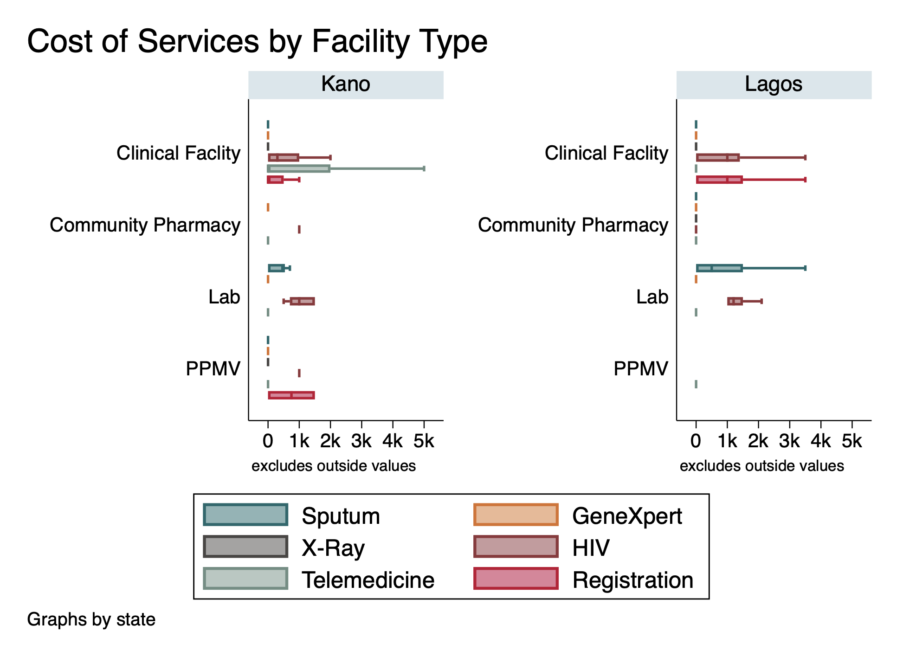

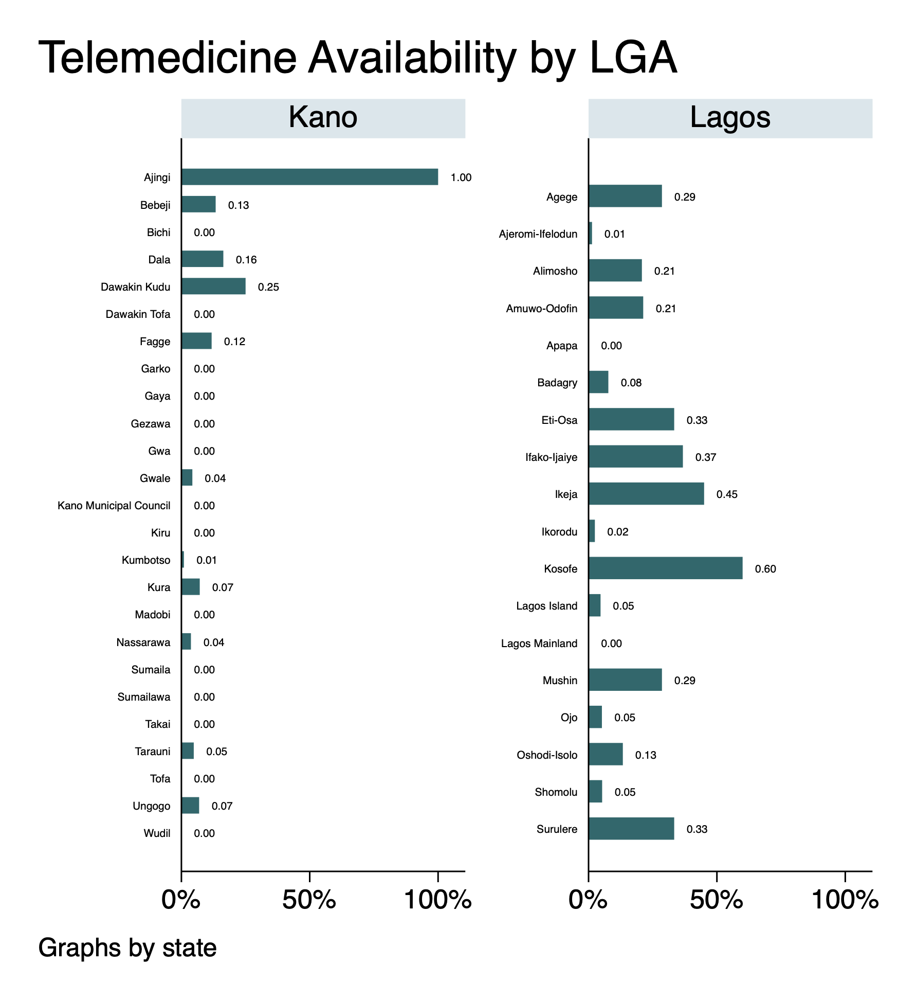

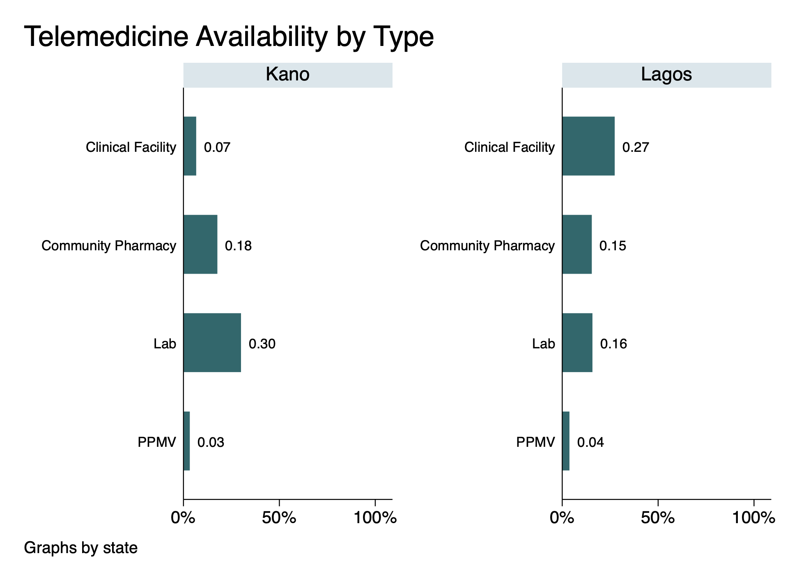

[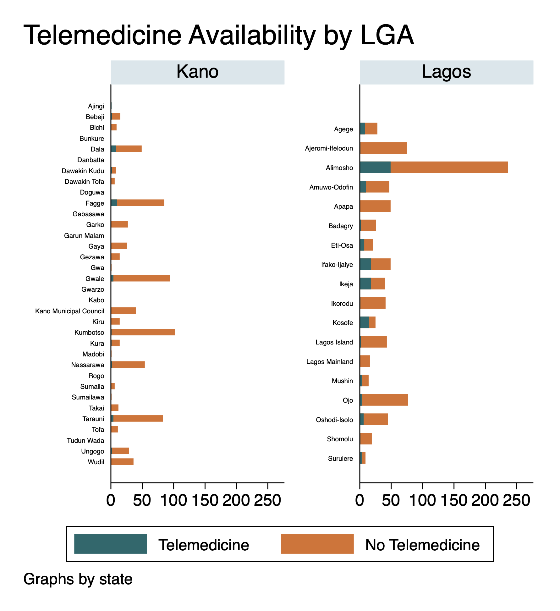](img/telemedicine3.csv)

[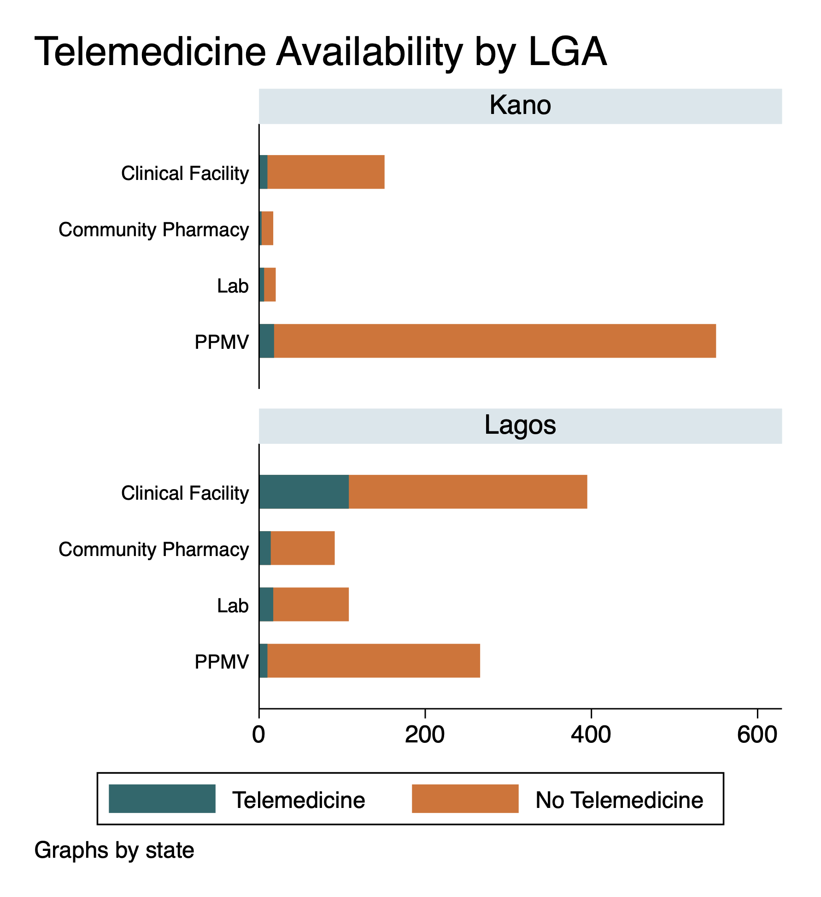](img/telemedicine4.csv)
